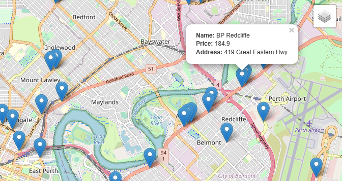

# Project3-Grp2
# Our project focus: Combatting Inflation

  

Please visit the link to see our
[Dashboard](https://shanCH3n.github.io/Project3-Grp2/dashboard.html)

### Aim
The aim of this project is to tell a story by creating an interactive dashboard that examines consumer price index (CPI) inflation rate among various categories. We developed a series fo visualisations to aid users in making an informed choice of the best priced location of their chosen consumerable.

### Motivation
Australia experienced record levels of inflation in 2022 in comparison to previous years as a result of the effects from the COVID-19 pandemic.
The Reserve bank of Australia's inflation target is to keep annual consumer price inflation between 2 and 3 per cent, on average,
over time. Although the federal government and Reserve Bank forecasted that inflation would peak at 7.75% in the December quarter of 2022. 

### The Process 
#### Extracting, transforming and loading:
The data was scraped from various Western Australian websites (links provided below). Leaflet maps were then generated by retrieving coordinates from a Mongodb database through connecting a flask app with Mongo and utilising jQuery to pass it into Javascript. Here are some samples of the MongoDB collection and a snippet of our leaflet map for petrol stations.

  
  
  

#### Organising our data and creating html
A HTML was developed as a shell for our dashboard and it was structured to display our graphs and maps. These were grouped into the following categories:
- Australian Buereau of Statistics - CPI trends
- FuelWatch WA - where to source best petrol prices
- Supermarket comparisons - Coles vs ALDI

Multiple leaflet maps and bar charts (with plotly) were created. These visualisations were then extracted in HTML format and loaded into the HTML dashboard shell as they were being created. Throughout the project, we often reviewed how we wanted the dashboard to look and restuctured the layout to suit our objectives.

### The end result

#### Flask App Landing Page

#### Our final dashboard

  
  
  

Real Overview of Budget and Alternatives (ROBA) Dashboard.

### Resources
- Data Sources: [FuelWatch WA](https://fuelprice.io/api/), [Australian Bureau of Statistics](https://explore.data.abs.gov.au/), [Coles](https://www.coles.com.au/)
- HTML code: <a href="https://github.com/shanCH3n/Project3-Grp2/blob/main/dashboard.html" target="_blank">dashboard.html</a>
- Software: Visual Studio Code
- Python
    - Flask
    - Beautiful Soup
    - Feedparser (to read RSS Feeds)
    - PyMongo
- HTML, CSS
- JavaScript Libraries
    - Plotly
    - Leaflet
    - jQuery (not covered in course)
- NoSQL: mongoDB
    - mongosh
    - mongoCompass
- GitHub
    - Github Pages
- Google
    - Google Docs
    - Google Slides
